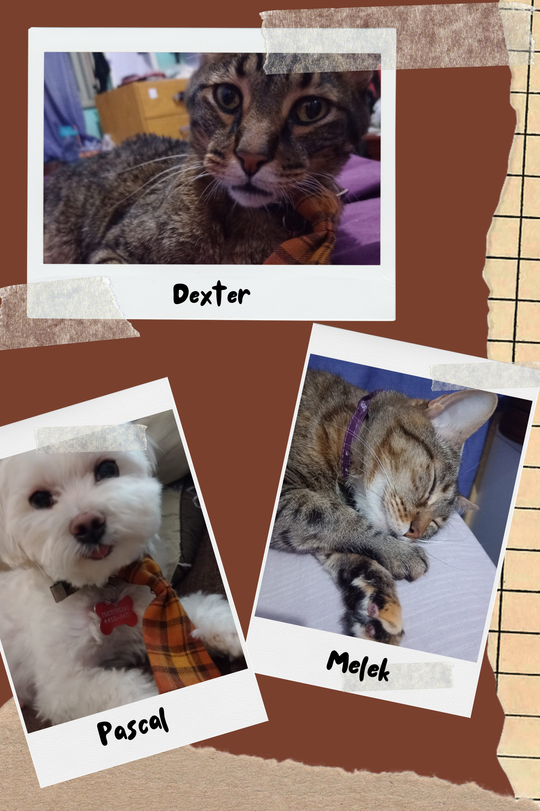

# Programación con objetos I
## Presentación Personal

### Datos Personales
- Mi nombre es: Díaz Rocío Belén
- Vivo en Hurlingham
- Tengo 27 años

### Otra Información
- Me encuentro cursando el segundo año de la Tecnicatura Universitaria en Programación
- Anteriormente cursé la Licenciatura en Criminalística, para la cual estoy haciendo la tesis para poder recibirme
- Vivo con mi familia, formada por Marcelo (mi papá), Paula (mi mamá) y Julieta (mi hermana menor)
- Tengo tres mascotas: un perro llamado Pascal y dos gatos llamados Dexter y Melek

